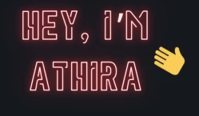

<!-- Main Container -->
<!-- Main Container -->

  <!-- GIF Section -->
 

    
  

  <!-- Introductory Text Section -->
  

    
A passionate <strong>Computer Science and Engineering</strong> student at B V Raju Institute of Technology. I love working on exciting projects, exploring new tech, and challenging myself to learn and grow!

  

  <!-- GIF Section -->
 

---

### 🎓 Education
- **B V Raju Institute of Technology**, B.Tech in Computer Science and Engineering, CGPA: 9.2  
  *Narsapur, Medak, Telangana* (2022-2026)

---

### 🛠️ Technical Skills

#### 💻 Programming Languages

  
  
  
  
  

#### 🗄️ Database Management

  

#### 🛠️ Tools

  
  
  
  
  

---

### 🏆 Achievements & Tech Experience
  -  **Open Source Contributor** — *GirlScript Summer of Code (GSSoC Extended 2k24)*  
  Contributed to open-source projects as a participant in GSSoC, where I collaborated on various repositories and tackled challenging issues.  
  *Badges Earned:*  

  
  
  
  
  
  
  <!-- Add more badges as needed -->

- Advanced to **Smart India Hackathon 2023 & 2024** intercollege round
- Member of the **Data Science Hub at BVRIT**
- Competed in various hackathons including *Unstop* and *Tech Surge 2024*

### 📚 Projects
#### [Popular Repositories]
- [**Diabetic Foot Ulcer Detection**](https://github.com/AJ-Athira/Prediction-of-Diabetic-Foot-Ulcer-Detection.git)  
  Developed a classification system using TensorFlow/Keras with EfficientNetB3 and InceptionResNetV2.

- [**Early Cure**](https://github.com/AJ-Athira/Early_Cure_WebApp.git)  
  A responsive site which can detect certain diseases like HyperTension, Neurological disorders, Heart conditions and Scheloroderma which is built using Python,Flask, HTML, CSS, and JavaScript.

- [**OCR Web App**](https://github.com/your-github/ocr-web-app](https://github.com/AJ-Athira/ocr_web_app))  
  An OCR app using character recognition algorithms, deployed on Streamlit.

Feel free to reach out via GitHub issues or connect with me for collaborative projects and tech discussions. Let's create something amazing together!
